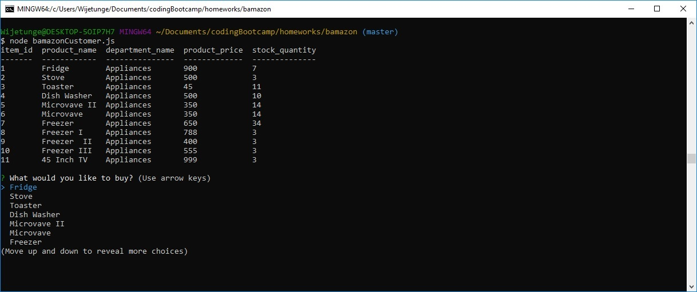
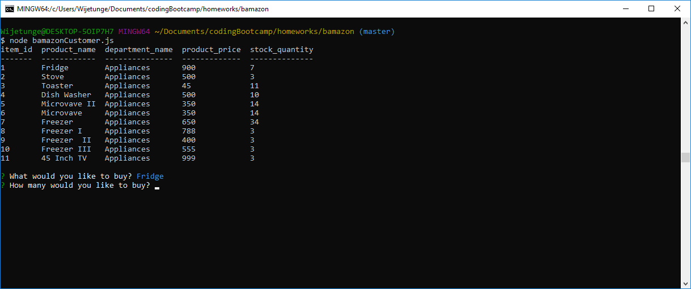
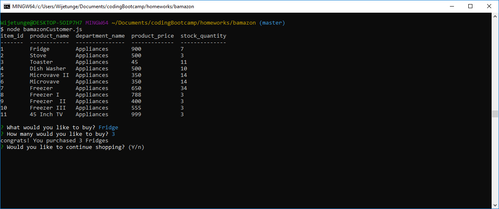
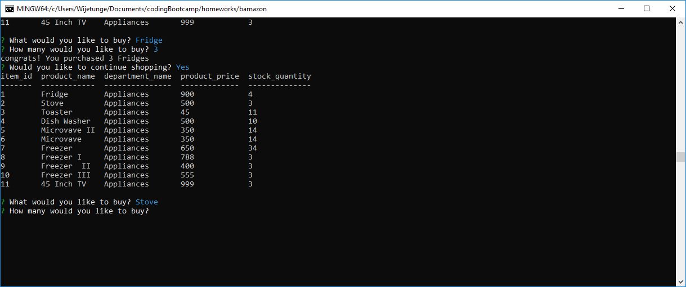
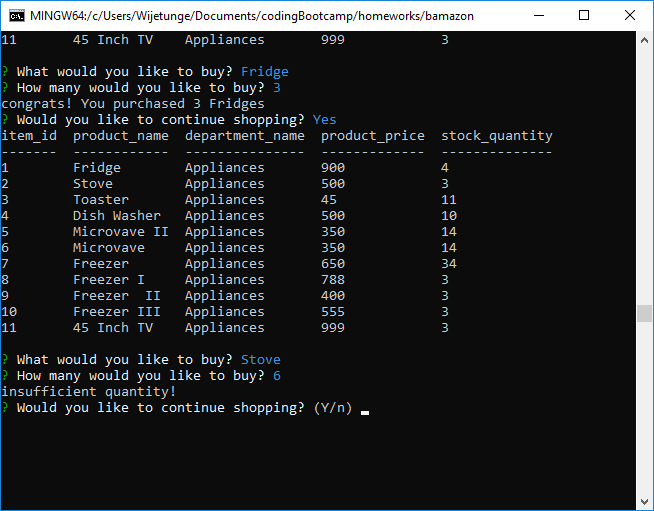

## Overview

This application is an Amazon-like storefront utilizing MySQL

The application will take in orders from customers and deplete stock from the store's inventory. 

The "console.table"  npm package was used to display the tables in a more readable format.

# bamazon
Initial screen 

The next 4 screen shows the application in action where the customer requests a quantitiy that is less than or equal to the quantity on hand.

"Fridge" was selected and "Enter" was pressed

"3" was entered for qyantity

When "Y" was entered the updated quantity is displayed

The next screens shows the application in action when the customer requests a quantitiy that is more than the quantity on hand.

